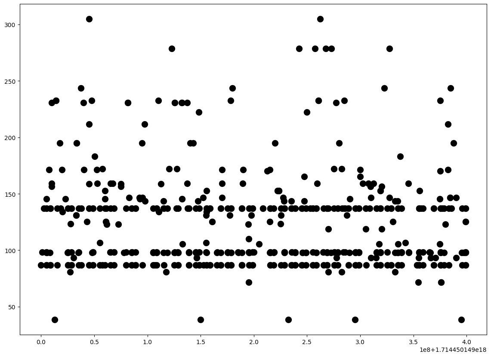
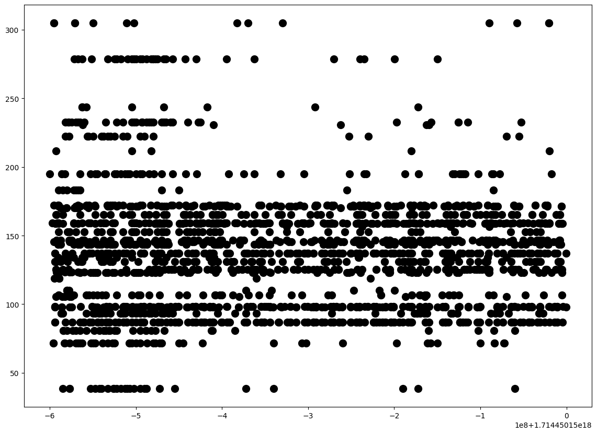
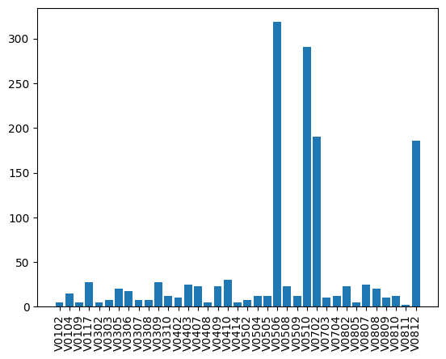
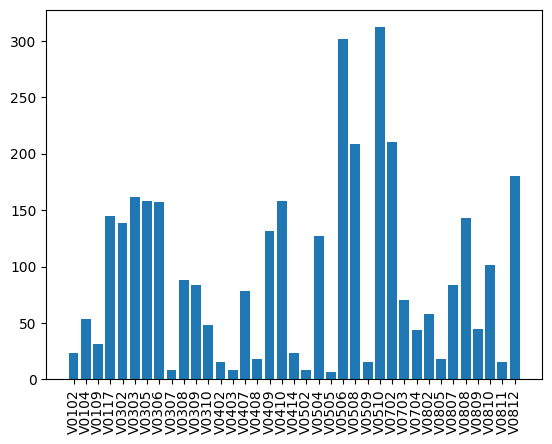
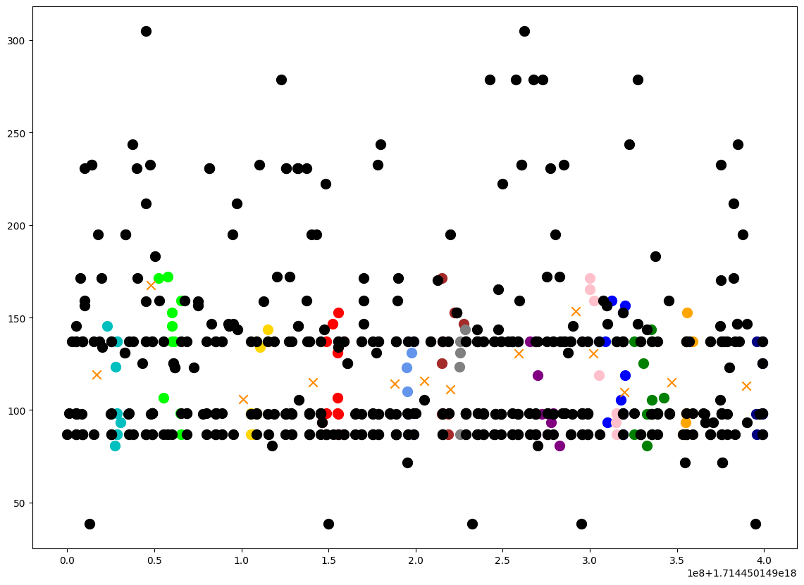
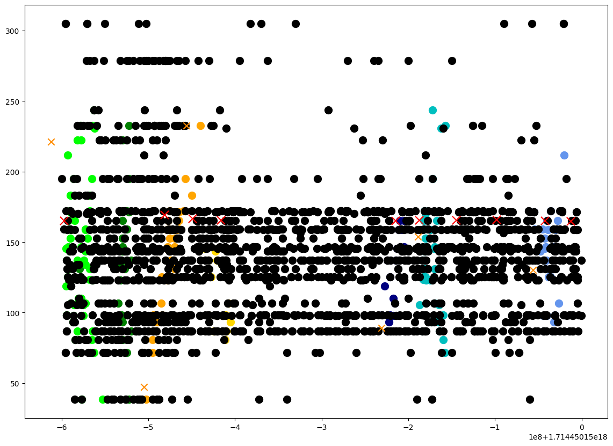
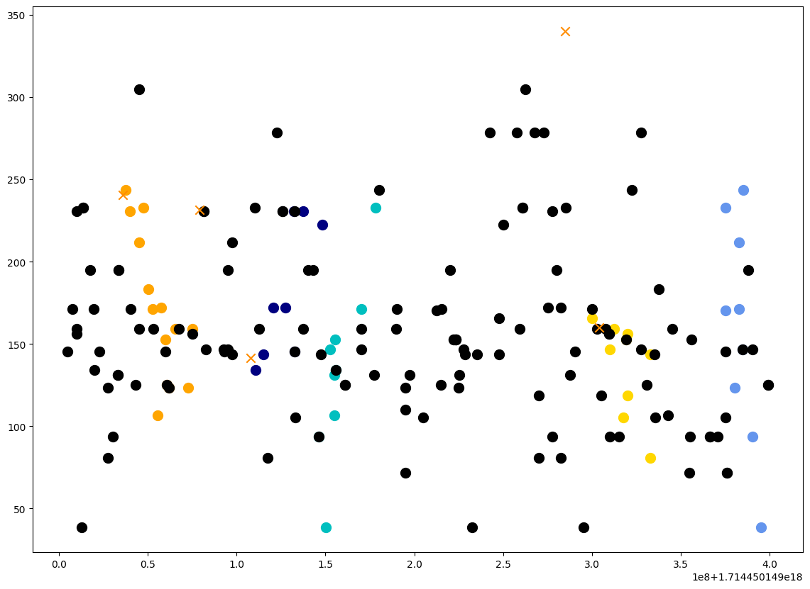
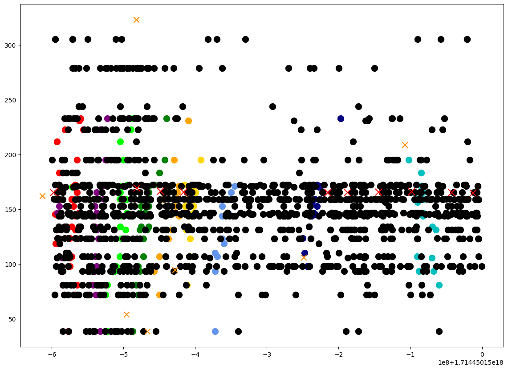

# First Tests with m0 Dataset

## data selection
Using dataset from: `2024-04-30 04:09:09.000030` until `2024-04-30 04:09:09.399515`, and from `2024-04-30 04:09:09.400030` until `2024-04-30 04:09:09.999515`.

|                              |                               |
| :--------------------------: | :---------------------------: |
|  |  |

## rates

|                     |                      |
| :-----------------: | :------------------: |
|  |  |

## unfiltered

|                         |                          |
| :---------------------: | :----------------------: |
|  |  |

## filtered

|                                  |                                   |
| :------------------------------: | :-------------------------------: |
|  |  |

